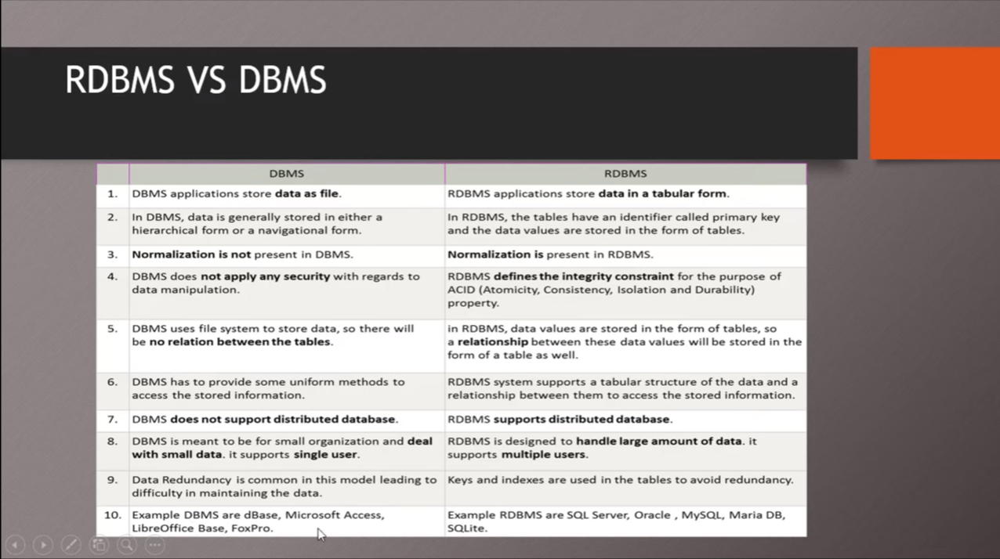
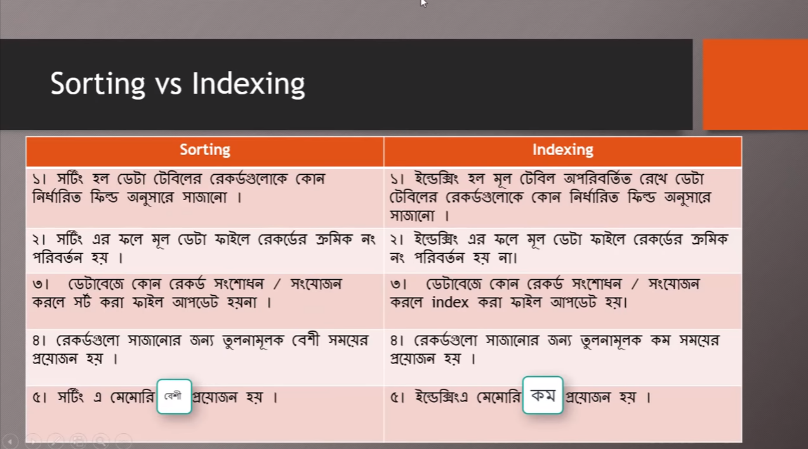

# Database Management 
---
 ## [Introduction to Database](https://www.youtube.com/watch?v=8fKPGcdw7_c&list=PLgH5QX0i9K3qLcx9DvVDWmNJ7riPvxzCD&index=2&t=203s)

- [x] Data = unprocessed or meaningless fact.
- [x] Information = processend & meaningfull fact.
  
 
### Difference between data & information: 
- [x] Data is a collection of facts, while information puts those facts into context.

  

 ### What is database?
- [x]  Collection of similar/related data
 

### What is data base management system?
- [x] Database Management Systems (DBMS) are software systems used to store, retrieve, and run queries on data.In short the tool or software where we can make stucture, table of database.

### Difference between dbms and file system?
- [ ] will add later.

### Benifits of Database?

### Types of database?
- [ ] Will add later.

 ### Elements of database?
 - [x] Field - column
 - [x] Record - row
 - [x] Value (data)

- [x] Key Field : Key field is the unique field in the table (eg: Roll, Name, Gender)
  
   - [x] Primary Key : The field that helps to identify each record separately is called primary key field(eg: 101, 102 are identifical so Roll is primary key. )
    - [x]  Composite key: When primary key is not enough to identify a record. Then we need to multiple key field to identify a record. These are composite key.
    
    
    - [x] Foreing key: When a primary key of a table becomes normal key of another table it is called foreing key of that table. A table can consist multiple foreign keys. Foreign key created relation between two tables.
   
   

### Works of DBMS?
1. CREATE DATABASE
1. UPDATE DATBASE
1. BACKUP AND RECOVERY DATABASE
1. SAVE DATA
1. RETRIEVE DATA
1. DELETE DATA
1. SECURE DATA etc.

### What is Relational database System?
- [x] Relation among tables.There must be atleast one common field with same data type and field size and also atleast one table needs to have primary key to create relation among tables. In short, RDMS connects two or more tables and helps to transfer data among them.
      
` Obserbation: Consider a single database as a table and RDBMS as the collection of tables those have relation or connection among them.`

### What is one to one relation?
- [x] When a row in a table is related to only one role in another table and vice versa,we say that is a one to one relationship .This relationship can be created using Primary key constraints.

Here,101 record of table-A is related to only
record one record of table-B. Hence it creates one to one relation.

`Note:` To create this realtion, a common primary key is needed in both tables.

More Details: 
- [Aritcle](https://medium.com/@emekadc/how-to-implement-one-to-one-one-to-many-and-many-to-many-relationships-when-designing-a-database-9da2de684710)
- [video](https://youtu.be/9KD2LFrbn4k)

### What is one to many relation?
- [x] This is where a row from one table can have multiple matching rows in another table this relationship is defined as a one to many relationship. This type of relationship can be created using Primary key-Foreign key relationship. In sort, Relation among one record of a table with multiple record of another table.

### What is many to many relationship?
- [x] A row from one table can have multiple matching rows in another table, and a row in the other table can also have multiple matching rows in the first table this relationship is defined as a many to many relationship.
- [x] This type of relationship can be created using a third table called “Junction table” or “Bridging table”. This Junction or Bridging table can be assumed as a place where attributes of the relationships between two lists of entities are stored.
- [x] Both primary key of two tables become the foreing key of junction table.

This kind of Relationship, allows a junction or bridging table as a connection for the two tables.

Another Example: 

### What is Database sorting ? 
- [x] Organizing records of a database according to a specific field.
- [x] Sorting creates separate data file.
- [x] After adding new records,it doesn't sort automatically. Hence, sorting is required after each changes and it comparatively takes time for continuous sorting.

 

 ### What is database indexing?
 - [x] Indexing doesn't change main table. The changes will be filled in index file.
 - [x] Index file doesn't contain any record.It contains only logical order for ascending or descending.
 - [x] As it doesn't contain records like sorting. Therefore, it takes less memory.
 - [x] Adding new data, will be indexed automatically.Serial number of main data file or table will not change.

Difference between sorting and indexing-

More details: 
- [link](https://www.edupointbd.com/sorting-and-indexing-of-database-ev/)

### [What is Database Encription?](https://youtu.be/0kSwY48KYPQ)
- [x] Database encryption is a critical security measure that protects sensitive data from unauthorised access or tampering.
- [x] Data encription is a part of data security
- [x]  Encryption is a process to change the form of any message in order to protect it from reading by anyone.
- [x] Types of data encryption-
   - [x] caesar code :
       - [x] key : secret code that encrypt or decrypt
       - [x] clipher text: after encryption the text we               get.
       - [x] Decryption: clipher text to original plain text or real text
        
- [x] Symmetric-key encryption : the message is encrypted by using a key and the same key is used to decrypt the message which makes it easy to use but less secure.
- [x] Asymmetric Key Encryption: Asymmetric Key Encryption is based on public and private key encryption techniques. It uses two different key to encrypt and decrypt the message. It is more secure than the symmetric key encryption technique but is much slower.
- [x] Difference between Symmetric-key encryption and asymmetric key encription
      
|Symmetric Key Encryption|Asymmetric Key Encryption|
| --- | ---|
|It only requires a single key for both encryption and decryption.     | It requires two keys, a public key and a private key, one to encrypt and the other one to decrypt.    |
|Security is less as only one key is used for both encryption and decryption purpose.|It is more secure as two keys are used here- one for encryption and the other for decryption.|
|The size of cipher text is the same or smaller than the original plain text.     |The size of cipher text is the same or larger than the original plain text     |
|The encryption process is very fast.     |The encryption process is slow.     |
| It is used when a large amount of data is required to transfer.    |It is used to transfer small amounts of data.     |
|It is efficient as it is used for handling large amount of data. |It is comparatively less efficient as it can handle a small amount of data. |
|It only provides confidentiality.     |It provides confidentiality, authenticity, and non-repudiation.     |
|The length of key used is 128 or 256 bits |The  length of key used is 2048 or higher |

Resource: [Link](https://www.geeksforgeeks.org/difference-between-symmetric-and-asymmetric-key-encryption/)

### [What is Query?](https://www.youtube.com/watch?v=ULXupjN_B2Q&list=PLgH5QX0i9K3qLcx9DvVDWmNJ7riPvxzCD&index=10)
- [ ] will add later.

  
### What is Query language?
- [x] the language we use for query is called query language
- [x] Type of Query language-
   - [x] QUEL (Query language)
   - [x] QBE (query by example)
  - [x] SQL (structured query language)
        
- [x] About SQL
  - [x] It is not case sencitive.
  - [x] Every line is considered as statement which ens with semicolon.
  - [x] Type of SQL statement:
      - [x] DML statement : Select, insert , update, delete (record)
      - [x] DDL statement : create, Alter (change) , Drop (delete table/database)
      - [x] DCL
      - [x] DTL
  
### About DBMS ?
- [x] DBMS = Data Base Management System
DBMS = DB +MS

- [x] A database management system (DBMS) is a software that enables
users to create and maintain a database.

some examples of popular DBMS are MySql, Oracle, Sybase,
Microsoft Access and IBM DB2 etc.

### Mysql vs sql ?
- [x] SQL is a query programming language that manages RDBMS. MySQL is a relational database management system that uses SQL

      
        
       

  

 
